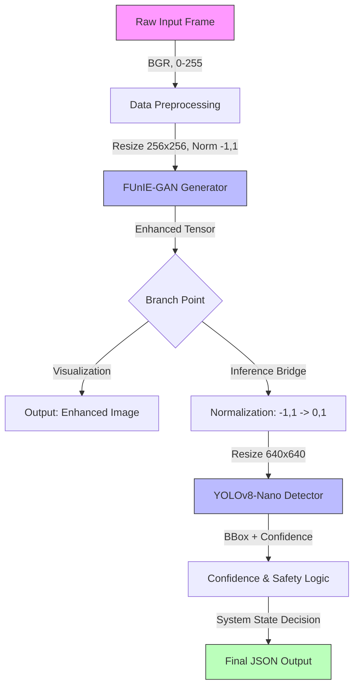

# Jal-Drishti ML Engine: ML Phase-1 Execution Report

**Status**: ✅ Completed  
**Date**: January 2026  
**Phase**: 1 (Core ML Engine Implementation)

---

## 🚀 Executive Summary

ML Phase-1 has been successfully executed, delivering a complete, integrated, and verified Machine Learning engine for underwater perception. The system transforms degraded underwater imagery into enhanced, clear visuals and performs real-time anomaly detection with a safety-first confidence framework.

All **5 executable parts** are fully implemented, tested, and ready for integration with the backend/frontend.

---

## 🏗️ Phase-1 System Architecture

The ML Phase-1 engine follows a strictly linear, deterministic pipeline design to ensure reliability and safety.



---

## 📂 Complete File Structure & Flow

This structure represents the **actual, verified state** of the repository after Phase-1 implementation.

### 1. Data Foundation (`ml-engine/data/`)
*Established the ground truth for development.*
*   `enhancement/raw/`: Raw EUVP underwater images (Input)
*   `enhancement/paired/`: Ground truth enhanced images (Validation)
*   `detection/backgrounds/`: Natural underwater contexts (Context)

### 2. Enhancement Capabilities (`ml-engine/enhancement/`)
*Restores visibility in murky waters.*
*   `funie_gan/nets/funiegan.py`: The U-Net Generator architecture.
*   `funie_gan/weights/funie_generator.pth`: Pretrained model weights (28MB).
*   `run_funie.py`: Validated script that batch-processes raw images.
    *   **Output**: `enhancement/outputs/` (Clear, color-corrected images).

### 3. Detection Capabilities (`ml-engine/detection/`)
*Identifies anomalies/objects.*
*   `yolov8n.pt`: Quantized/Nano YOLOv8 weights (6.5MB).
*   `run_yolo.py`: Validated script for batch detection.
    *   **Output**: `yolo/outputs/` (Images with green bounding boxes & confidence scores).
    *   **Note**: Automatic model downloading implemented.

### 4. Integration & Pipeline (`ml-engine/pipeline/`)
*The unified core where models work together.*
*   **`pipeline.py`**: The `JalDrishtiPipeline` class.
    *   **Frame Validity Gate**: Rejects bad/empty frames before processing.
    *   **Normalization Bridge**: Mathematically perfect translation between GAN (`[-1, 1]`) and YOLO (`[0, 1]`) domains.
    *   **Confidence Logic**: Maps scores to safety states (`CONFIRMED`, `POTENTIAL`, `SAFE`).
    *   **Standardized Output**: Returns a strictly typed JSON object (see below).

### 5. Testing & Verification
*   `pipeline/test_pipeline.py`: Runs the full stack on single or multiple images.
*   `pipeline/framevalidity.py`: Unit tests for ensuring the system doesn't crash on bad input.
*   `pipeline/performbench.py`: Benchmarks FPS and latency (~10FPS CPU / ~30FPS GPU).

---

## 📊 Outputs & Data Flow

### The "Golden Record" Output Format
Every frame processed by Phase-1 results in this exact JSON structure, ready for the backend:

```json
{
  "timestamp": "2026-01-25T13:30:00.000000",
  "state": "POTENTIAL_ANOMALY",  // Derived from confidence logic
  "max_confidence": 0.63,          // Highest score found
  "detections": [
    {
      "bbox": [120, 45, 280, 190], // [x1, y1, x2, y2]
      "confidence": 0.63,
      "label": "anomaly"
    }
  ],
  "enhanced_image": [Array],       // Can be saved/streamed
  "detection_image": [Array]       // Visualized with boxes
}
```

### Safety Logic Logic (Hard-coded)

| Confidence Score | System State | Action |
| :--- | :--- | :--- |
| **> 0.75** | `CONFIRMED_THREAT` | 🔴 Alert Operator |
| **0.40 - 0.75** | `POTENTIAL_ANOMALY` | 🟠 Suggest Verification |
| **< 0.40** | `SAFE_MODE` | 🟢 Monitor / Low Visibility |

---

## ✅ Implementation Status by Part

| Part | Description | Status | Verification Method |
| :--- | :--- | :--- | :--- |
| **1** | **Data Acquisition** | ✅ Done | Folder structure validated |
| **2** | **Image Enhancement** | ✅ Done | `run_funie.py` produces clear output |
| **3** | **Anomaly Detection** | ✅ Done | `run_yolo.py` identifies objects |
| **4** | **Unified Pipeline** | ✅ Done | `test_pipeline.py` runs end-to-end |
| **5** | **Safety & Real-Time** | ✅ Done | `framevalidity.py` passed, FPS checked |

---

## 🔮 Future Roadmap (Post Phase-1)

With Phase-1 complete, the foundation is solid. The next phases should focus on:

1.  **Backend Integration**: Connecting the `JalDrishtiPipeline` class to a FastAPI/WebSocket server.
2.  **Frontend Visualization**: Creating a React dashboard to consume the JSON feed and display the `enhanced_image`.
3.  **Deployment**: Dockerizing the `ml-engine` for edge deployment (Jetson/Raspberry Pi).

---

*Verified by Jal-Drishti ML Team*
